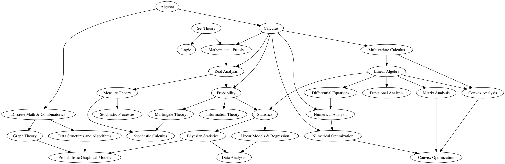

# Math-Requirements-For-Machine-Learning-Data-Science
A graph representing what courses and prerequisites are required to have a rigorous understanding of Machine Learning and/or Data Science

**Please contact me via [Issues](https://github.com/michaelbasca/Math-Requirements-For-Machine-Learning-Data-Science/issues) if there is a mistake or if you would like to add anything else.**
